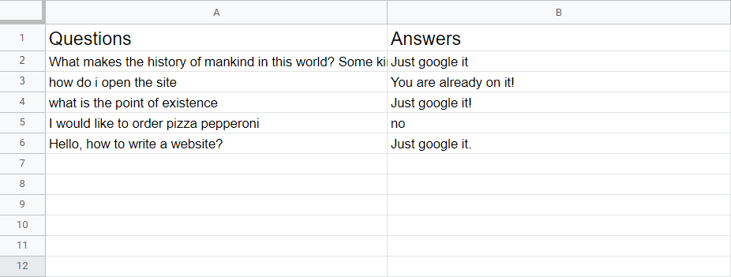

# BS21-07 Seamless Customer Support tool

## Description

This project is an implementation of a seamless customer support tool for different websites using the API which retranslates questions of users from the web application to telegram bot connected to Q&A database and volunteer team. Almost all customer-oriented websites nowadays have a tool to ask a question to the Q&A  team, but most of them require the team to answer from the website itself, which creates a need to switch platforms if there are different websites.

The main advantage of this tool is its integrability. It can be used for a high amount of diverse websites without a volunteer team needing to change their messaging platform.

## Demo

**Telegram bot**

Volunteer starts the chat with the telegram bot and registers into the system. Volunteer is then added into the database of volunteers and marked as "user".

When user asks a question in the web application, it is handed to the telegram bot, which sends requests for answer to all of volunteers from the list.

**Web application**

User opens the web application and asks questions in it, getting answers afterwards. User also can refresh the web page or even close it and the chat with volunteer will remain.

**Database**

After getting the answer, bot sends it back to the website and also adds it to the Google Sheets database. For every next question, bot will check if there is any similar enough questions with answers in the database and, if so, answer to users with it immediately.

## How to use

Admin should run the server and the tg bot separately. Now, after activating the bot, it will receive messages and add volunteers to the list in "volunteers.txt". To get the link to the Google Sheets database, user can write "/link" to the bot. Only the bot and admin can manage the database to avoid errors.

Next, after the web app is activated, app session can be launched locally. User can write the question to start the request for answer.

## Features

 - Using cookies for storing user sessions even after closing;
 - Using requests for answers to avoid interruptions in answers;
 - Storing previously answered questions;
 - Using existing answers to answer new similar questions.

## Installation

To install the project, download it and separately run the frontend and backend folders. Change "bot_id" variable in bot.py to your id.

## Frameworks

The project uses Python3 with Aiogram, SQLite and Apiclient APIs for telegram bot and database implementation and Flask framework for the web tool part.

## Badges

## Team members
- Damir Afliatonov
- Ivan Kobets
- Makar Vavilov
- Askar Kadyrgulov
- David Polischuk
- Nikolai Ershov

## License

MIT License

Copyright (c) 2022 Damir Afliatonov

Permission is hereby granted, free of charge, to any person obtaining a copy
of this software and associated documentation files (the "Software"), to deal
in the Software without restriction, including without limitation the rights
to use, copy, modify, merge, publish, distribute, sublicense, and/or sell
copies of the Software, and to permit persons to whom the Software is
furnished to do so, subject to the following conditions:

The above copyright notice and this permission notice shall be included in all
copies or substantial portions of the Software.

THE SOFTWARE IS PROVIDED "AS IS", WITHOUT WARRANTY OF ANY KIND, EXPRESS OR
IMPLIED, INCLUDING BUT NOT LIMITED TO THE WARRANTIES OF MERCHANTABILITY,
FITNESS FOR A PARTICULAR PURPOSE AND NONINFRINGEMENT. IN NO EVENT SHALL THE
AUTHORS OR COPYRIGHT HOLDERS BE LIABLE FOR ANY CLAIM, DAMAGES OR OTHER
LIABILITY, WHETHER IN AN ACTION OF CONTRACT, TORT OR OTHERWISE, ARISING FROM,
OUT OF OR IN CONNECTION WITH THE SOFTWARE OR THE USE OR OTHER DEALINGS IN THE
SOFTWARE.
